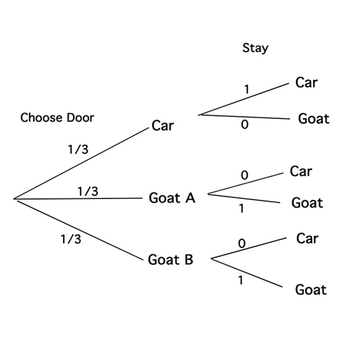
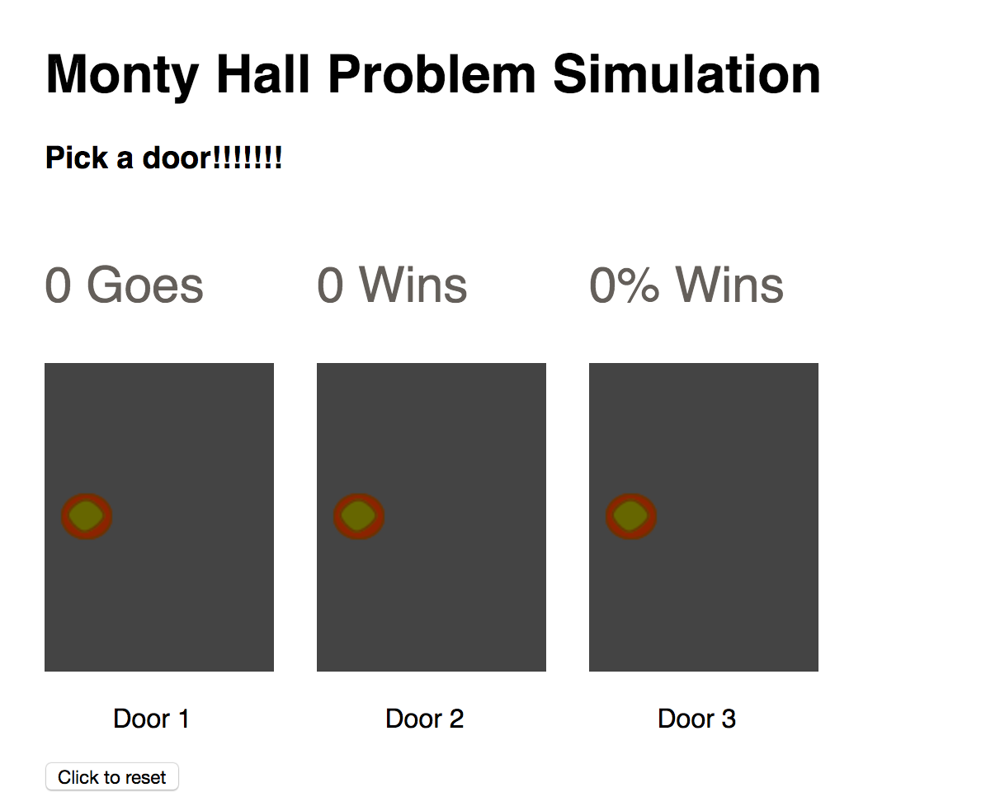

# Exercise  - The Monty Hall Problem

In the session we're going to build a monty hall problem simulation. **Note**, this is a challenging task. **If you complete it please send me a link to your solution on gitHub** . Don't worry if you can't complete the solution, you'll learn lots just attempting it.

## The Problem

> > Suppose you're on a game show, and you're given the choice of three doors:  
> > Behind one door is a car; behind the others, goats.  
> > You pick a door, say No. 1, and the host, who knows what's behind the doors, opens another door, say No. 3, which has a goat.  
> > He then says to you, "Do you want to pick door No 2?" Is it to your advantage to switch your choice?

#### It turns out you're twice as more likely to win if you switch doors

## 1 Setup

Download the starting files from [**here**](http://learn.solent.ac.uk/mod/resource/view.php?id=680143)

## 2  Identify the elements

> > yours won't look like this until after we run the set game function

In `index.html` add `id` attributes with appropriate names to:

* Door1, Door2, Door3 images , they currently do not have a source we'll sort that out next
* The reset button
* Goes wins and %wins
* The question, which currently contains "Pick a door!!!!!!"

## 2 Start the main function

Open `main.js` notice how we have the following variables defined at the top of the page:

\`\`\` var door1;   
    var door2;   
    var door3;  
    var question;  
    var prize\_door;  
    var current\_go = 1;

    The above are global variables, this means they're accessible from any location in the program. 

    Within the `main()` function assign the `door image` elements to each of the door vars and also for the question. For example `door1` is the id of my first image:

     `door1 = document.getElementById('door1');`

    You should set assign elements to the following vars:

door1 =  ...   
door2 =  ...  
door3 =  ...  
question = ...  
\`\`\`

## 3 Complete the setUpGame\(\) function

The `setUpGame()` gets the game ready it is called after we assign elements to our door and question variable. Firstly, it generates a random number between 1 and 3. Next, it sets the `src` of each of our door images.

`Math.floor(Math.random() * 3) + 1`

Complete the following:

* Set the `src` of each of the doors to `img\door.png`

**Run your webpage, it should now look like the above image**

## 5 Add click events to each of the doors

* Within `main()`, add click events to each of the doors. Calling `door1click()`,`door2click()` and `door3click()`.
* Place a `console.log()` in each of the functions, so you know they are working

## 6 Complete the basic game play logic

* To start with, we'll make the first choice in our head. The second choice will be maid by clicking

* For each of the door click functions check if that door equals the prize door. If it does display the car image.

* Choose a way to notify if the use has won or lost

* Increase the go by 1 for each guess.

## 7 Add a click event to the reset button

Add a click event to the reset button so it runs `setUpGame()`

## Complete the remaining functionality

It's mostly up to you to work this out. Please implement the following functionality

* Update the question so on every second go it asks you if you want to switch or stick. Only revealing the prize after this choice has taken place.

  > > Hint, use the modulo function to differentiate between odd and even goes

* Update the stats

**If you get this far email your git hub solution**

