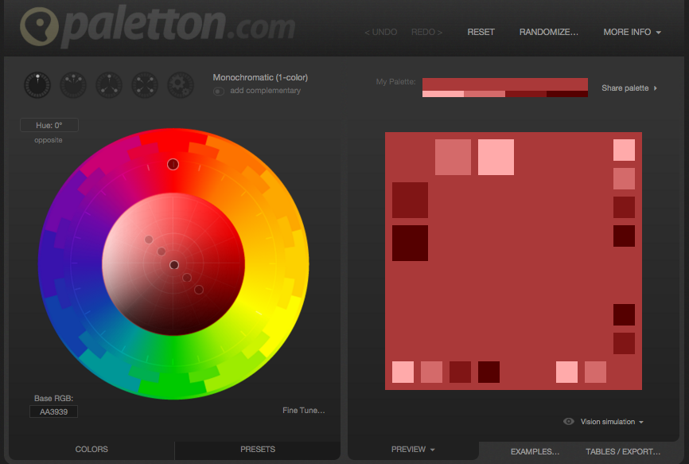

#Picking a Color Scheme For Your Website 
>> Note your assessment will not be marked on this 

* You're making a website for humans, choosing the right colour scheme can have a huge effect on user engagement. Choose badly and people will not spend very long on your site

* Sometimes, visually awkward colors can work, but most of the time this is not the case:

>> [http://www.lingscars.com/](http://www.lingscars.com)

* Even though we're not marking your assessments based on your colour choices, you should still aim to make an aesthetically pleasing portfolio piece 

#How to find Colours That Work Well Together

[http://paletton.com/](http://paletton.com) allows you to pick a primary colour and find further colours  that work well together according to classical colour theories:

