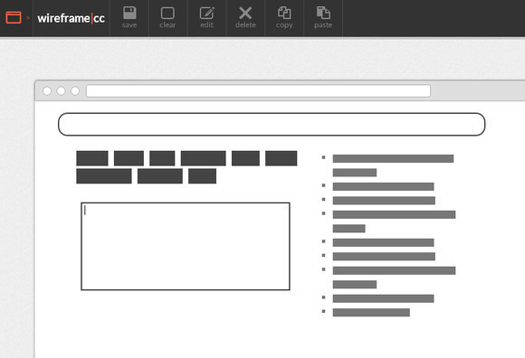

#Exercise  - Create your order form wire frame

Today we're going to give you the opportunity to create the wire frames for your assessment. Firstly you'll want to understand the scope of what is going to be created by reading the [assignment brief](http://learn.solent.ac.uk/course/view.php?id=20825&section=1) 

## Pick your wire framing tool of choice and create a mock up

Even though you can use any wire framing tool you like, we highly recommend [wireframe.cc](https://wireframe.cc/) checkout their website and watch the demo video.  It makes the process of creating wires frames intuitive and simple. 

**TIP** in order to export your final mock up, you'll be required to upgrade to the paid version. You can take a screen shot , which will be fine for your assessment.  [Click here if you don't know how to take a screen shot](http://www.wikihow.com/Take-a-Screenshot-in-Microsoft-Windows)
  

##Extra Task 

[Start to source some rights free images for your website](https://martinsolent.github.io/copyright/copyright2016_v2/). 

 

