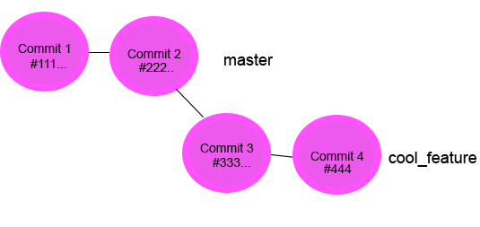

##Branching 

- Used to develop features in isolation 
- If I want to develop a cool new feature, I can run `git checkout -b cool_new_feature`
- The above command simultaneously creates a new branch and checks it out
- **Note**, I'm now working in complete isolations to the **master** branch 
- When my feature is stable, I can switch back to master and merge the changes
	- `git checkout master`
	- `git merge cool_feature`
- Once the branches are merged , it's normal to remove the feature branch 
	- `git branch -d my_cool_feature`

##Further Reading and Exercises 
[A very good guide](http://rogerdudler.github.io/git-guide/)   
[GitHub remotes](https://help.github.com/categories/managing-remotes/)  
[Git branching](https://git-scm.com/book/en/v2/Git-Branching-Basic-Branching-and-Merging) 
[Git branching](https://www.atlassian.com/git/tutorials/using-branches/)    
[A great visual tool for learning](http://learngitbranching.js.org/)

