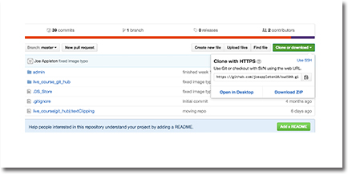

#Git Remote Repositories 

- One of the true powers of working with GIT 
- They allow us to store our work in any location that is running a GIT server
- You'll never lose your work 
- [www.github.com](www.github.com), the most popular remote host

###Using GitHub as a remote host 



>> <sub> Getting the remote address of a repository </sub>

###Git Clone

- If you wan't a carbon copy of a repository by running, `git clone <address>
` 
- If you run `git clone https://github.com/joeappleton18/swd500.git` you'll get a full carbon copy of the entire repository containing the course material on your local computer 

###Setting up a new repository 

You can also set up a brand new repository on gitHub


###Two way communication 

- Git Clone is fine if we just want to pull a project directly off GITHUb and store it locally. 
-  Most of the time you'll want to send changes back to GITHub for safe keeping
	
**Git makes this easy:**

- Get the remote address of your repository, as shown in the diagram above
- Locally create a empty folder to hold your project 
-  Then locate this folder from your shell application and run the following commands

```bash 
git init 
git remote add origin <remote address>
```

As you can see `git remote` takes two arguments  
	- The remote name, `origin` in this case. This is so we can easily reference the remote without having to remember the full address 
	- Running `git remote -v`, will display your remote address

	

We can now `push` and `pull` to the remote host

- `git pull origin master`  //pulls files from the origin 
- `git push origin master` // sends files to origin  

The typical workflow would be:

- **Pull** from the origin, work locally and make regular commits on a branch
- When you end your work session, **push** the changes to the origin for safe keeping 

**Hint: You can push local branches to gitHub**

Often you'll want to store your feature branch on the remote repository. 

**This is simple to achieve:**

```git push --set-upstream origin <the name of your branch>``` 

**Once the branch is created in your remote repository you can omit the `--set-upstream` flag**


	
	


