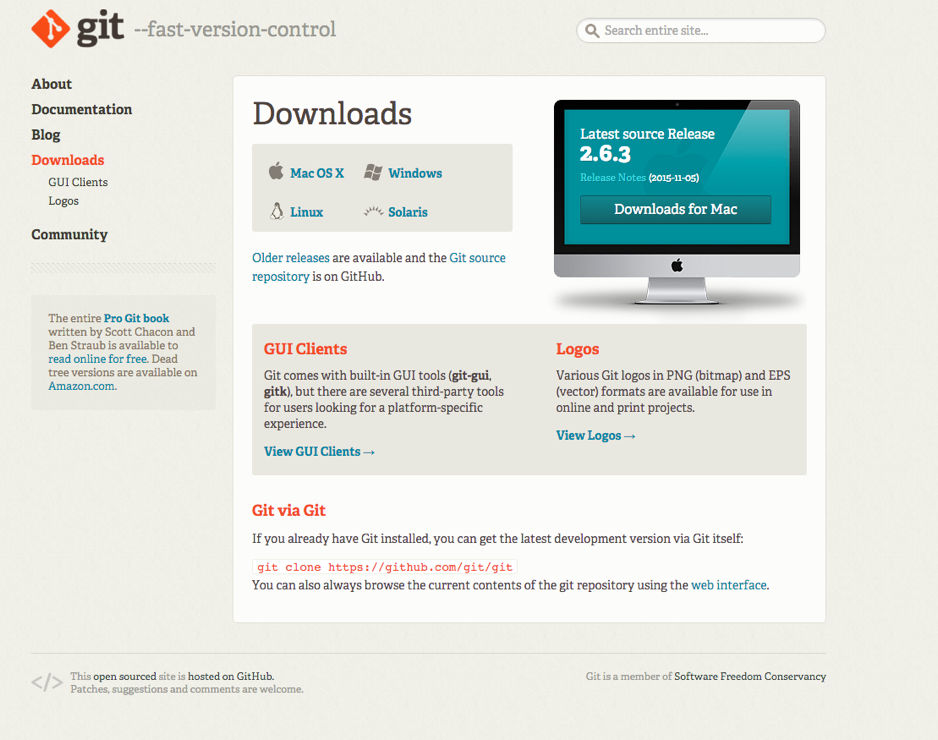

#How to install Git 

GIT is easy to install on a desktop computer.

- [Simply download and run the executable](https://git-scm.com/download/win)

- If you are using the university computers, you can use [https://c9.io/](https://c9.io/). A cloud text editor which comes with a free pre installed version of GIT.

##Further resources 

- [GIT Home page](https://git-scm.com/)
- [GIT download link](https://git-scm.com/download/win)

