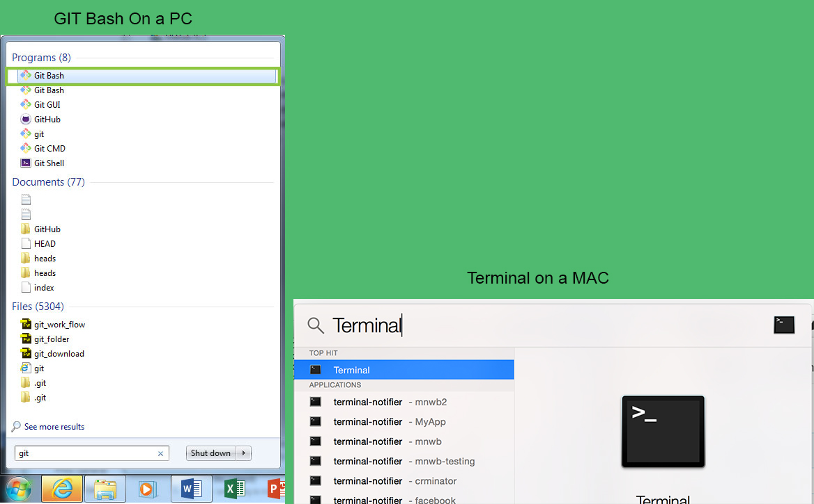

#Using Git on the command line

- You can either use command line or a GUI tool to manage GIT
- We'll focus on command line for this tutorial 
- Most people tend to use command line/terminal over the GUI application

>> If you're using windows for the sake of this tutorial open GIT bash (it comes with your git installation). If you're using a MAC open terminal. 

##Further resources 

- [Essential terminal commands](http://www.hongkiat.com/blog/web-designers-essential-command-lines/)
