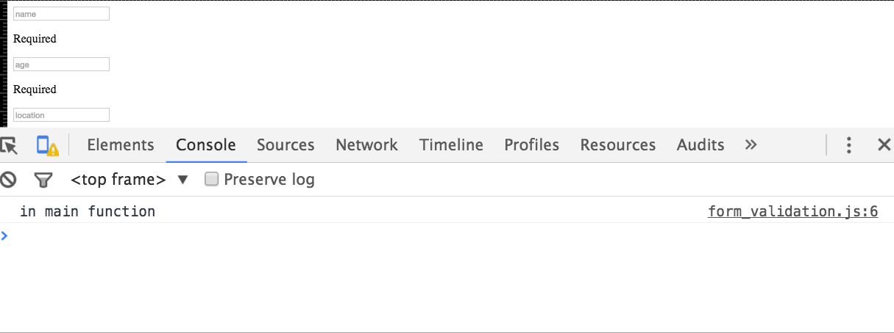

#Exercise 1 - Form Validation

The idea of this exercise is to introduce how to perform basic form validation in an incremental fashion.  The process has been broken down into steps,  you'll tutor will demo straight the solution to each step after the allotted time. If you're not in the lesson the entire solution will be available in next weeks notes. 


## 1 Set up folder structure and blank files (~3 mins)
Having an organised file structure is vitally important. Luckily, it's also very easy to achieve

Within a new folder create the following project structure:


## 2 Create a form  (~5 mins)

Within index.html create a new form with the following `<input type="text"` fields:


|field name| 
|----------|
|name      | 
|age       | 
|location  |
|email     |
|phone_number|
|address_line_1|
|post_code| 

For the sake of this example let's assume all the fields are required. Beneath each input place a `<p>` element containing the error message to be displayed if the above input is not filled in. 

**Note** each `<p>` element should have a unique `id` attribute  e.g. 

```html
 <p id="errorName" style="display:none"> Required </p>  
```


## 3 Create the `<body>` `onload()` event (~3 mins)

1) Within the `<head>` of your  `index.html` page include your javaScript file. 

2) Add a `onload` attribute within your html file's `<body>` tag that calls the `main()` function within your javaScript file. 

3) Create a `main()`  function in your javaScript file and to test it's being called when you html file loads add `console.log("in main function")` in your `main()` function.

If all is good you should see "in main function" within the console tab in developer tools:




## 4 Add a `submit` event  to your form (~5 mins)
Add a submit event to your form that calls a function called `function validateForm(event)`. Within the function `validateForm` add the two lines:

```html
console.log("validating from");
event.preventDefault(event);
```
Press the submit button and check that validate form is printed to the console. 

## 5 Validate the Form On Submit (~20 mins)
Ok, we're nearly there, we just need to actually validate the form when it is submitted. The logic to perform this will be placed in the `validate_form` function. Below is the pseudo code. Pseudo code is a  informal language that allows us to design functionality of our programs. **Note**,
 you need to understand the pseudo code and write the equivalent javaScript
   
		function validate_form 
			
			Initialise form_valid to true
			if name empty
		        set form_valid to false 
		        display name error 
		        prevent form from submitting 
		    else 
		       set form form_valid to true 
		       hide name error
		    
		   if location empty
		        set form_valid to false 
		        display location error 
		        prevent form from submitting
		    else
		        set form form_valid to true
		        hide location error
		        
		   ... continue pattern for all other fields ...
		    
		  
Implement the above functionality using javaScript. 

## 7 Optional Advanced 

Research  [javaScript regular expressions](https://developer.mozilla.org/en/docs/Web/JavaScript/Guide/Regular_Expressions) and see if you can also check for a valid phone number and email.         